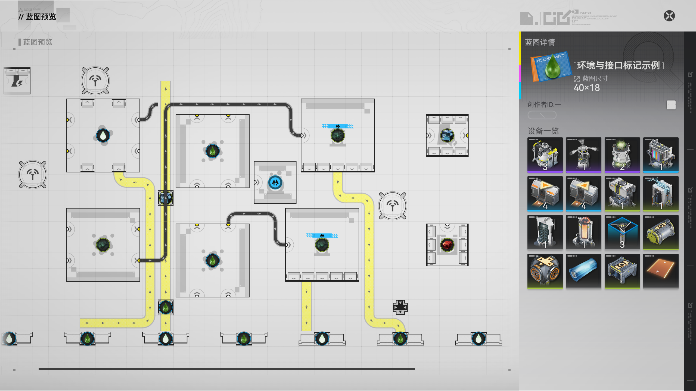

# 终末地蓝图编辑器

离线的《明日方舟：终末地》蓝图制图工具。摆放设备、连接传送带和管道、标记物品，并导出带自动设备清单的蓝图预览图片。



这是非官方的静态制图工具，不模拟生产、过滤、供电或账号解锁。保存的 JSON 是本工具的布局文件，不是游戏分享码。

## 直接使用

取得便携包 `endfield-blueprint-editor-版本号-portable.zip` 后，解压并用 Chrome / Edge 打开其中的 `blueprint_editor.html`。图片和 HarmonyOS Sans SC 字体均已内嵌，使用时无需联网或安装依赖。

**GitHub 的源码下载包需要先构建**，其中不包含生成的 `dist/`。本地构建方法见下一节；维护者可按[发布说明](docs/development.md#生成发布包)生成便携包。

1. 从左侧搜索设备，点击画布摆放；拖动设备移动，按 R 旋转。
2. 选中设备后设置物品图标、环境条、状态角标及接口显示。
3. 点击顶部「蓝图预览」，编辑名称、封面、创作者 ID、标签和描述。尺寸、设备图卡及数量根据布局自动生成。
4. 「导出完整预览 PNG」保存蓝图和右侧详情；「导出画布 PNG」只保存布局，可选透明背景。
5. 使用「保存 JSON」保留可继续编辑的文件。浏览器草稿按访问地址保存，换浏览器、端口或电脑前请先导出 JSON。

## 从源码构建

需要 Python 3.10+；当前验证环境为 Python 3.14。建议在虚拟环境中安装依赖。

```sh
python -m pip install -r requirements.txt
python scripts/verify_inputs.py
python scripts/build.py
python scripts/serve.py
```

最后一条命令会打开 `http://127.0.0.1:8769/blueprint_editor.html`。关闭服务后仍可直接用浏览器打开 `dist/blueprint_editor.html`。Windows 也可在安装依赖后双击 `build.cmd`，构建完成再双击 `start.cmd`。

构建只读取本项目的 PNG、字体与配置，无需游戏安装、原逆向工具包、Unity、Blender 或解包工具。离线成品约 74 MiB；`dist/baked/` 中的中间图片可以重新生成。

## 功能与操作

- 112 个建筑表条目、8 类物流节点；四向建筑图片按原始部件合成。
- 864 条可搜索的物品 / 环境记录，835 张徽标；支持设备、仓库口、物品准入口和管道准入口的手动标注。
- 传送带、管道、逐口显示、地下管道配对及静态连接效果。
- 5 种环境生效条，以及锁定、限时有效、过期等手动状态标记。
- 自动生成右侧四列设备清单，支持编辑详情、缩放取景、PNG 导出及 JSON 往返保存。
- 原始 UI 图片及内嵌 HarmonyOS Sans SC；导出前等待字体加载完成。

| 操作 | 用法 |
| --- | --- |
| 选择、移动 | V；点击或拖动已有设备 |
| 旋转 | R；拖动期间也可旋转 |
| 传送带、管道 | B / L；拖动铺设，Shift 切换转弯顺序 |
| 物品标记 | 选中设备，在物品库搜索名称或 ID |
| 环境条、状态与接口 | 选中设备，在右侧属性中设置 |
| 完整预览 | 顶部「蓝图预览」；滚轮缩放、拖动取景 |
| 撤销、重做 | Ctrl+Z / Ctrl+Y |
| 保存布局 | Ctrl+S 或「保存 JSON」 |
| 编辑画布平移、缩放 | 空格拖动 / 中键；滚轮 |

可导入的示例：基础布局 [demo_blueprint.json](examples/demo_blueprint.json)、环境条与接口 [environment_ports.json](examples/environment_ports.json)、暗管效果 [native_effects.json](examples/native_effects.json)。

仍有 29 条物品缺图、20 个特殊设备缺少大号底纹；部分装饰由 Canvas 近似绘制，动态 shader 效果没有完整复刻。详细边界见[显示层复核](docs/display-audit.md)与[缺图记录](docs/missing-icons.md)。

## 开发和验证

测试需要 Node.js 20+、pnpm 11.19.0 和 Google Chrome；当前验证环境使用 Node.js 24。构建完成后执行：

```sh
pnpm install --frozen-lockfile --ignore-scripts
pnpm test
pnpm smoke
```

`pnpm test` 运行 10 组、共 80 项回归检查；`pnpm smoke` 自动启动临时本地服务，从空白画布通过鼠标和按钮完成编辑、JSON 保存 / 导入及 PNG 下载。测试使用独立浏览器上下文，不修改日常草稿。输出位于忽略提交的 `reports/`。

GitHub Actions 会从源码构建，运行回归与完整 UI 流程，并验证发布包生成。目录结构、依赖安装、素材更新和上传步骤见[开发与发布说明](docs/development.md)。

## 素材和许可

游戏资源、字体与项目自身代码分别处理。字体保持原始文件和[随附许可](assets/fonts/LICENSE-update.txt)；来源见[项目说明](docs/project-notes.md)。项目自身代码暂未指定开源许可证，完整归属说明见 [THIRD_PARTY_NOTICES.md](THIRD_PARTY_NOTICES.md)。
